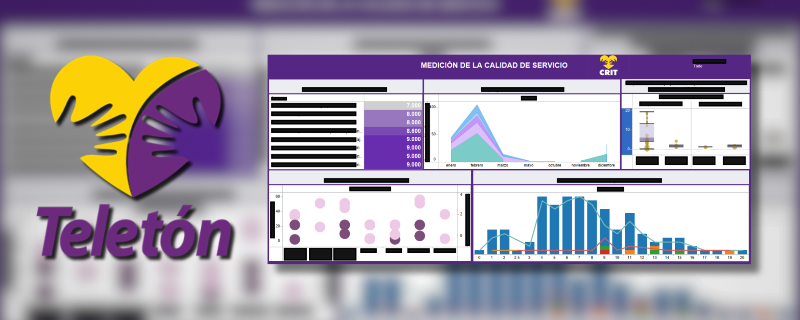

# OpenHealthData

> "Information is the oil of the 21st century, and analytics is the combustion engine."  
> — Peter Sondergaard (Gartner IT Symposium/Xpo, October 2011).

The intelligent collection, cleaning, processing and visualization of data is an indispensable process for the efficient, precise, productive and sharp **self-criticism** of any project. 

This project seeks to capture several performance variables of the health sector, including waiting times, rescheduling, treatment and follow-up of each citizen, generating a digital medical profile that promotes and facilitates the use and census of health services, taking into consideration the quantitative and qualitative state of the facilities, supplies and different types of employees.

## Background
This project started as a personal initiative during my university career at Tecnológico de Monterrey (ITESM), who has agreements with several companies to facilitate students the development of projects attacking the specific problems they have (in this case Teleton CRIT Morelia).

## Current development

> [!IMPORTANT]
> Pending approval and modifications to be treated as Open Source, as intended.

## Future work

- Facilitating export with gganimate.
- Native ggplot2-shiny dashboards.
- Local UX/UI.

## Contact

Feel free to reach out if you have any questions or feedback.

- **Email:** victorbenitogr@gmail.com
- **The subject must start with:**  [OpenHealthData]